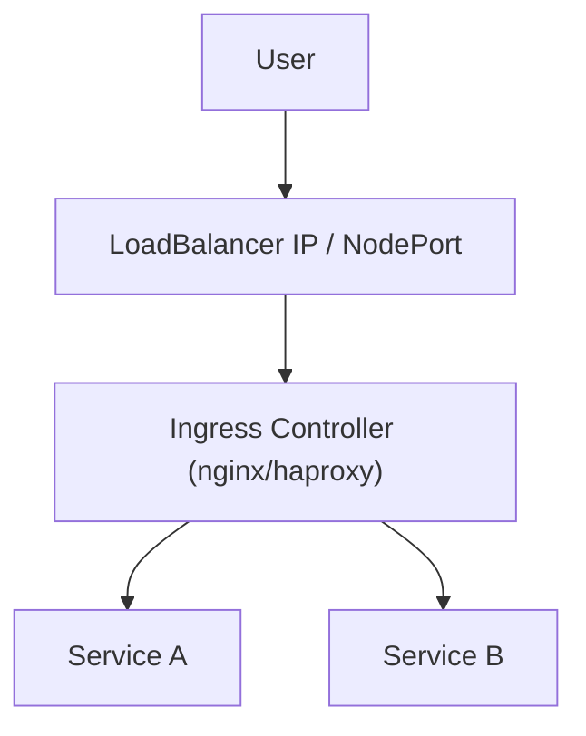

# 🌍 External Access to Kubernetes Services

While Kubernetes services make it easy for pods to talk to each other, exposing those services to **users and clients outside the cluster** requires additional tools like **NodePort**, **LoadBalancer**, or **Ingress**.

---

## 🚪 Entry Points into a Cluster

| Access Method   | Description |
|------------------|-------------|
| NodePort         | Opens a static port on each node (basic access) |
| LoadBalancer     | Uses a cloud provider’s external load balancer |
| Ingress          | Smart HTTP routing based on paths or domains |
| External DNS     | Exposes services via DNS names |

---

## 1️⃣ NodePort Recap

- Opens a port (e.g., `30001`) on all worker nodes
- Maps traffic to a **ClusterIP** service inside

```bash
http://<NodeIP>:<NodePort>
```

## 2️⃣ LoadBalancer Recap

- Works only on cloud environments
- Automatically provisions an external IP
- Maps traffic to a ClusterIP behind the scenes

## 3️⃣ Ingress Controller (HTTP Routing)

Ingress is a Kubernetes-native reverse proxy that:

- Listens on a single IP

- Routes HTTP/HTTPS traffic to services based on:

  - Hostname

  - Path prefix (e.g., /api, /admin)
- Supports SSL/TLS termination

🧠 Ingress Architecture


