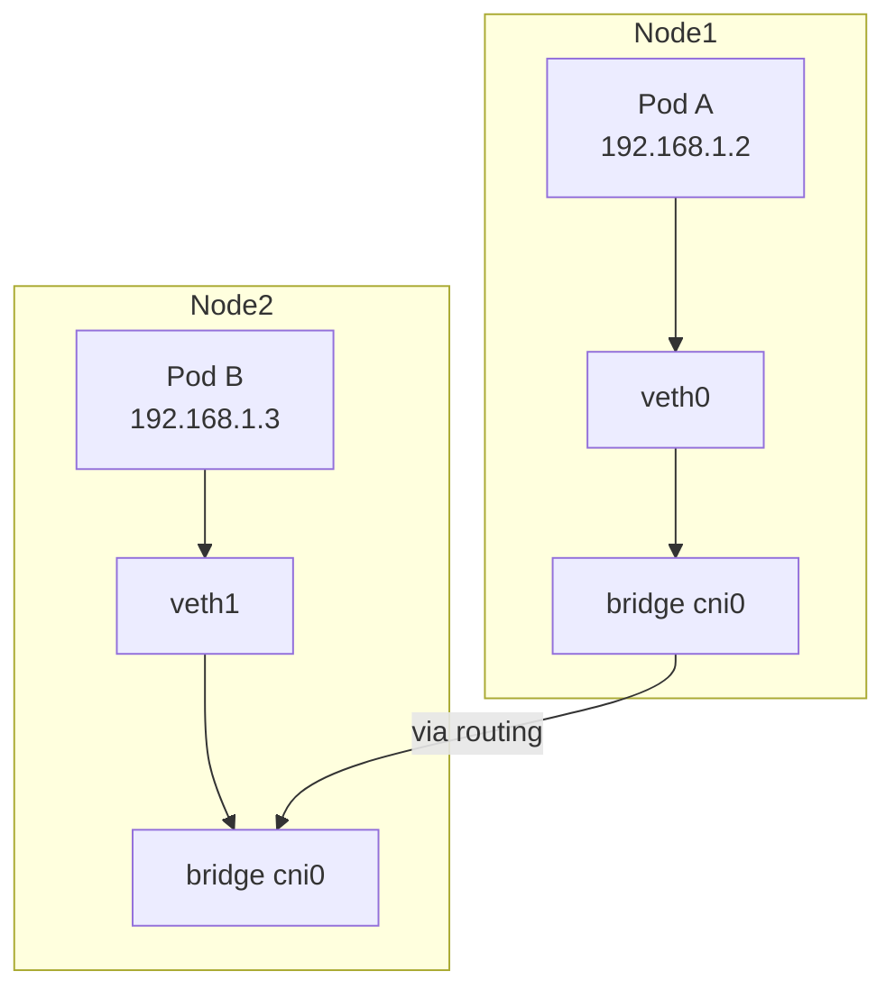

# 🌐 Node-to-Node Communication in Kubernetes

In Kubernetes, pods often need to talk across **different nodes**. This requires more than just local bridges — it involves **routing**, **kube-proxy**, and **CNI plugins** capable of multi-host networking.

---

## 🔁 What Happens Across Nodes?

When **Pod A (on Node 1)** sends traffic to **Pod B (on Node 2)**:

- The source pod sends a packet to the destination pod’s IP
- The node’s network stack checks if it owns that IP
- If not, it routes it through the correct path (via VPC, overlay, etc.)
- The destination node receives and delivers it to Pod B via its bridge

---

### 🖼️ Concept Diagram

