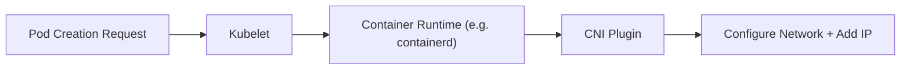

# 🚀 Kubernetes Networking: CNI & Pod Communication

This guide walks through the foundational concepts of Kubernetes networking — starting from how pods are plugged into the network using CNI, and how they communicate with each other on the same node.

---

## 🔌 CNI – Container Network Interface

CNI is the bridge between Kubernetes and the underlying network.

It handles:

- 📡 Assigning unique IP addresses to pods
- 🔗 Connecting pods to the node's network
- 🧩 Working with container runtimes like `containerd`, `crun`, `Kata`

### 🧱 What is CNI?

CNI is a **standard interface** and a set of **plugins** used to configure container networking. It's invoked by container runtimes during pod creation.

---

### ⚙️ CNI in Action

