# 📘 Kubernetes Networking Glossary & Visual Recap

This page summarizes key networking terms, components, and diagrams covered throughout the presentation.

---

## 📚 Key Terms

| Term                | Description                                                                                            |
| ------------------- | ------------------------------------------------------------------------------------------------------ |
| **CNI**             | Container Network Interface. A standard for configuring network interfaces in Linux containers.        |
| **veth pair**       | Virtual Ethernet pair connecting container network to host. Acts like a cable with two ends.           |
| **Bridge**          | Linux virtual switch that connects multiple containers/pods on the same node.                          |
| **Pod**             | Smallest deployable unit in Kubernetes, may contain one or more containers.                            |
| **Namespace (net)** | Linux isolation layer for network stack inside a container.                                            |
| **NodePort**        | Exposes a service via a static port on each node's IP.                                                 |
| **LoadBalancer**    | Creates a cloud-provider load balancer to expose services externally.                                  |
| **Ingress**         | Smart HTTP routing layer. Routes traffic based on paths or domain names.                               |
| **Kubelet**         | Agent running on each node, responsible for communicating with the API server and managing containers. |

---

## 🧠 Pod-to-Pod Flow Recap (Same Node)

🔁 Node-to-Node Traffic Flow

🌐 External Access Summary

```mermaid
flowchart LR
  user[🌍 User]
  domain["🔗 Domain (DNS)"]
  ingress[🚪 Ingress Controller]
  service[🧩 Kubernetes Service]
  pod[📦 Pod]

  user --> domain --> ingress --> service --> pod
```

## 📦 Service Type Cheatsheet

Service Type Scope Ideal Use Case
ClusterIP Internal only Pod-to-pod communication
NodePort External Quick dev access
LoadBalancer External Cloud production traffic
Ingress External (HTTP/HTTPS) Routing traffic to multiple apps

✅ Recommended Tools

- CNI Plugins: Calico, Flannel, Cilium, Weave
- Ingress Controllers: NGINX, Traefik, HAProxy
- Packet Tracing: tcpdump, wireshark, kubectl sniff
- Visualize Network: Weave Scope, Kube-ops-view, Lens

## 📎 References

1. [Kubernetes Networking Docs](https://kubernetes.io/docs/concepts/cluster-administration/networking/)
2. [CNI Plugin Spec](https://github.com/containernetworking/cni)
3. [Kubernetes Services](https://kubernetes.io/docs/concepts/services-networking/service/)
